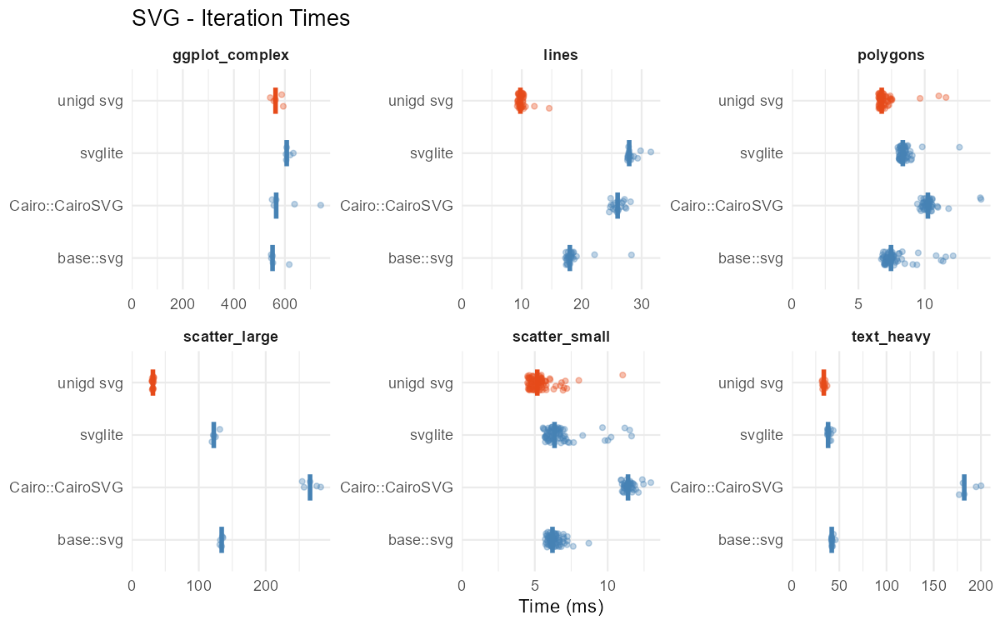
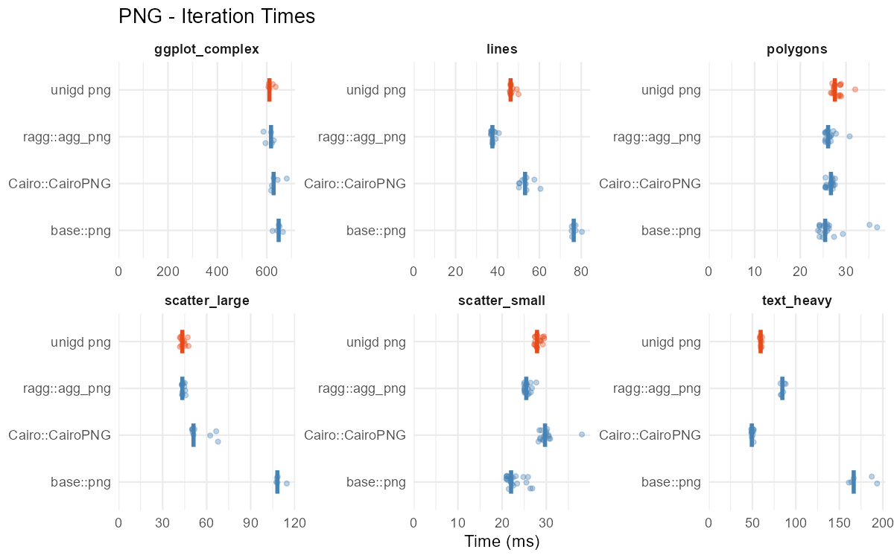
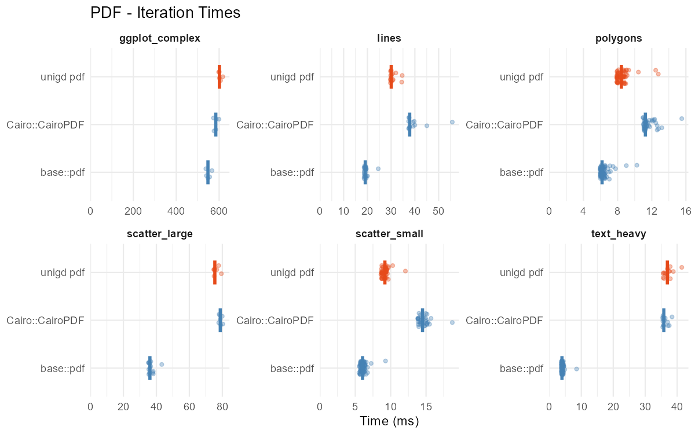
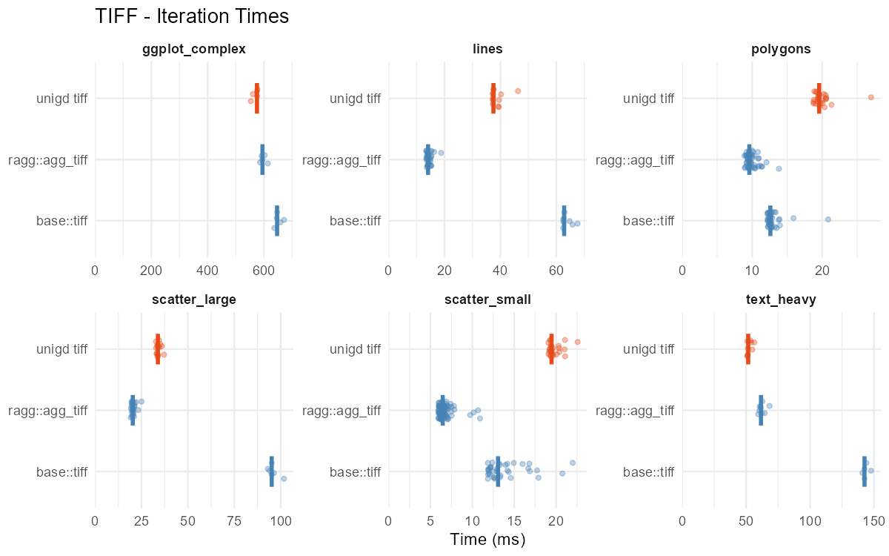
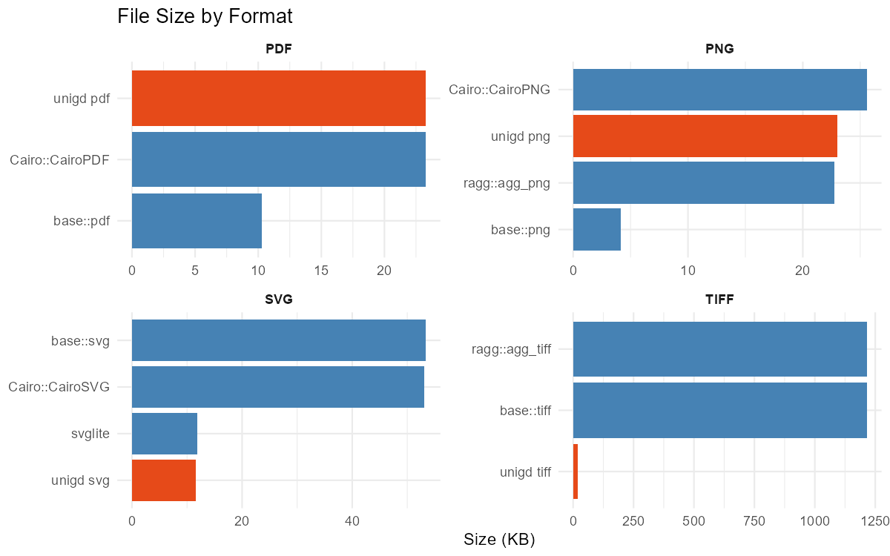

```{r setup, include=FALSE}
knitr::opts_chunk$set(
  echo = FALSE,
  eval = FALSE,
  warning = FALSE,
  fig.width = 8,
  fig.height = 4.5
)
results <- tryCatch(readRDS("bench_results.rds"), error = function(e) NULL)
has_results <- !is.null(results)
```

This vignette presents pre-computed benchmark results comparing `unigd`
rendering performance against base R graphics devices and popular alternatives.

Benchmarks are generated offline by running `Rscript bench/run.R` from the
package root. The vignette itself does not execute any benchmark code.

## Test Plots

```{r thumbnails, eval=TRUE, results="asis"}
plot_info <- list(
  scatter_small  = "100 points",
  scatter_large  = "10,000 points",
  lines          = "5 time series with legend",
  polygons       = "50 semi-transparent rects",
  text_heavy     = "200+ text labels",
  ggplot_complex = "Faceted scatter + smooth"
)

imgs <- character()
for (name in names(plot_info)) {
  img <- paste0("bench_plot_", name, ".png")
  if (file.exists(img)) {
    imgs <- c(imgs, sprintf(
      '<figure style="display:inline-block;text-align:center;margin:4px;vertical-align:top"><figcaption style="font-size:0.8em"><strong>%s</strong><br>%s</figcaption></figure>',
      img, name, name, plot_info[[name]]
    ))
  }
}
if (length(imgs) > 0) {
  cat('<div style="text-align:center">\n')
  cat(paste(imgs, collapse = "\n"))
  cat('\n</div>\n')
}
```

## Methodology

Each device renders every test plot using `bench::mark()` with a minimum of
5 iterations. Output file sizes are captured from a separate run.

Raster devices use 720 x 576 px; vector devices use 10 x 8 in
(720 x 576 px equivalent at 72 dpi).

The timing tables show the median time and a **ratio** comparing each
alternative device to the corresponding base R device (`base::svg`,
`base::png`, etc.), so values below 1.0x mean faster than base R.

**A note on Cairo backends:** unigd uses Cairo under the hood for PNG, PDF,
and TIFF output. Comparisons with `Cairo::CairoPNG`, `Cairo::CairoPDF`, etc.
therefore isolate device pipeline overhead (recording, serialization, file
I/O) rather than rasterizer differences.

The charts show individual iteration times as jittered points with a median
crossbar, giving a sense of run-to-run variability.

## Environment

```{r sysinfo, eval=has_results, results="asis"}
si <- attr(results, "sysinfo")
cat(sprintf(
  "Results were generated on **%s** (%s, %s) with **%s** at %s.\n\n",
  si$sysname, si$machine, si$platform, si$R.version,
  format(si$timestamp, "%Y-%m-%d %H:%M %Z")
))
if (!is.null(si$cpu) && !is.na(si$cpu)) {
  cat(sprintf("**CPU:** %s\n\n", si$cpu))
}
if (!is.null(si$packages)) {
  pkgs <- si$packages[!is.na(si$packages)]
  if (length(pkgs) > 0) {
    cat("**Package versions:** ",
        paste(sprintf("%s %s", names(pkgs), pkgs), collapse = ", "),
        "\n")
  }
}
```

```{r helpers, eval=has_results}
fmt_ms <- function(seconds) {
  ms <- seconds * 1000
  ifelse(ms >= 100, sprintf("%.0f ms", ms),
    ifelse(ms >= 1, sprintf("%.1f ms", ms),
      sprintf("%.2f ms", ms)))
}
fmt_ratio <- function(ratio) {
  ifelse(is.na(ratio), "\u2014", sprintf("%.1fx", ratio))
}

fmt_bytes <- function(bytes) {
  ifelse(is.na(bytes) | bytes == 0, "\u2014",
    ifelse(bytes >= 1048576, sprintf("%.1f MB", bytes / 1048576),
      ifelse(bytes >= 1024, sprintf("%.1f KB", bytes / 1024),
        sprintf("%d B", as.integer(bytes)))))
}

is_unigd <- function(name) grepl("^unigd ", name)
compute_summary <- function(df) {
  agg_time <- aggregate(time ~ group + device + plot, data = df, FUN = median)
  agg_fs   <- aggregate(file_size ~ group + device + plot, data = df, FUN = function(x) x[1])
  out <- merge(agg_time, agg_fs)
  out$device <- factor(out$device, levels = unique(df$device))
  out$plot   <- factor(out$plot,   levels = unique(df$plot))
  out
}
render_group_table <- function(df) {
  summ <- compute_summary(df)
  devices <- levels(summ$device)
  plots_order <- levels(summ$plot)
  base_dev <- devices[1]
  base_df <- summ[summ$device == base_dev, ]
  base_medians <- setNames(base_df$time, base_df$plot)
  tab <- data.frame(Plot = plots_order, stringsAsFactors = FALSE)
  for (dev in devices) {
    sub <- summ[summ$device == dev, ]
    vals <- sub$time[match(plots_order, sub$plot)]
    if (dev != base_dev) {
      ratios <- vals / base_medians[plots_order]
      cells <- paste0(fmt_ms(vals), " (", fmt_ratio(ratios), ")")
    } else {
      cells <- fmt_ms(vals)
    }
    if (is_unigd(dev)) cells <- paste0("**", cells, "**")
    col_name <- if (is_unigd(dev)) paste0("**", dev, "**") else dev
    tab[[col_name]] <- cells
  }
  knitr::kable(tab, align = c("l", rep("r", ncol(tab) - 1)))
}
```

## SVG

unigd's deferred rendering architecture records graphics commands first, then
serializes on demand. This avoids redundant intermediate state and tends to
show an advantage on complex plots.

```{r svg-table, eval=has_results, results="asis"}
svg_df <- results[results$group == "SVG", ]
if (nrow(svg_df) > 0) render_group_table(svg_df)
```

```{r svg-chart, eval=TRUE, results="asis"}
if (file.exists("bench_chart_svg.png")) cat('\n')
```

## PNG

```{r png-table, eval=has_results, results="asis"}
png_df <- results[results$group == "PNG", ]
if (nrow(png_df) > 0) render_group_table(png_df)
```

```{r png-chart, eval=TRUE, results="asis"}
if (file.exists("bench_chart_png.png")) cat('\n')
```

## PDF

```{r pdf-table, eval=has_results, results="asis"}
pdf_df <- results[results$group == "PDF", ]
if (nrow(pdf_df) > 0) render_group_table(pdf_df)
```

```{r pdf-chart, eval=TRUE, results="asis"}
if (file.exists("bench_chart_pdf.png")) cat('\n')
```

## TIFF

```{r tiff-table, eval=has_results, results="asis"}
tiff_df <- results[results$group == "TIFF", ]
if (nrow(tiff_df) > 0) render_group_table(tiff_df)
```

```{r tiff-chart, eval=TRUE, results="asis"}
if (file.exists("bench_chart_tiff.png")) cat('\n')
```

## File Sizes

```{r size-overview-table, eval=has_results, results="asis"}
if ("file_size" %in% names(results)) {
  agg <- aggregate(file_size ~ group + device, data = results, FUN = function(x) x[1])
  agg <- agg[agg$file_size > 0, ]
  if (nrow(agg) > 0) {
    agg$category <- ifelse(
      is_unigd(agg$device), "**unigd**",
      ifelse(grepl("^base::", agg$device), "base",
        ifelse(grepl("^Cairo::", agg$device), "Cairo",
          ifelse(grepl("svglite", agg$device), "svglite",
            ifelse(grepl("ragg", agg$device), "ragg", agg$device)))))
    formats <- c("SVG", "PNG", "PDF", "TIFF")
    formats <- formats[formats %in% unique(agg$group)]
    cat_order <- c("base", "svglite", "ragg", "Cairo", "**unigd**")
    categories <- cat_order[cat_order %in% unique(agg$category)]
    tab <- data.frame(Format = formats, stringsAsFactors = FALSE)
    for (cat in categories) {
      sub <- agg[agg$category == cat, ]
      vals <- sub$file_size[match(formats, sub$group)]
      tab[[cat]] <- fmt_bytes(vals)
    }
    knitr::kable(tab, row.names = FALSE, align = c("l", rep("r", length(categories))))
  }
}
```

```{r size-overview-chart, eval=TRUE, results="asis"}
if (file.exists("bench_chart_filesize.png")) cat('\n')
```

Notable: unigd TIFF output uses compression, producing files ~20x
smaller than `base::tiff` and `ragg::agg_tiff` which default to uncompressed
TIFF.

## Summary

These results are specific to one machine and configuration.

- **unigd SVG** benefits from deferred rendering -- graphics commands are
  recorded first, then serialized when output is requested. This avoids
  redundant work on complex plots.
- **PNG**: all Cairo-based devices (`base::png`, `Cairo::CairoPNG`, unigd)
  perform similarly since they share the same rasterizer. `ragg::agg_png` uses
  its own AGG backend and can be faster on some workloads.
- **PDF**: `base::pdf` uses R's built-in PDF writer and is consistently the
  fastest. unigd and `Cairo::CairoPDF` both use Cairo and show similar
  overhead.
- **TIFF**: `ragg::agg_tiff` is the fastest raster device here. unigd TIFF
  is slower on most plots but produces dramatically smaller files thanks to
  compression.

To reproduce on your own system:

```r
Rscript bench/run.R
```
